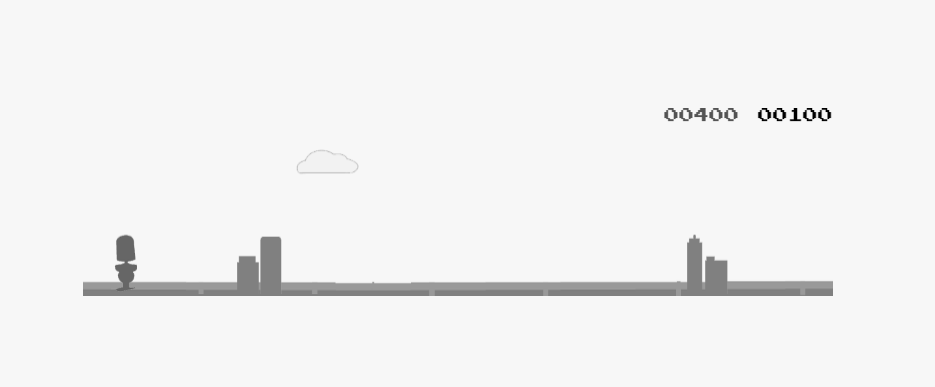

<h1 align="center">
  <br>
  <a href="https://chrisdothtml.github.io/chrome-dino" target="_blank"></a>
  <br>
  <br>
</h1>

# Wally's Adventure

Train game similar to the Google Dinosaur game for my IMM 280 Class ('22)

This is a reskin and update of the game created by Chris Deacy. You can find his repo [here](https://github.com/chrisdothtml/chrome-dino)
He features an almost identical Chrome dinosaur game and we changed the sprites to be more
train themed after Wally the Whistle

## Run locally

Delete the yarn.lock file and then run the commands below.

```bash
# Install Dependencies
# If you got an error with something similar to:
# "https://unpm.uberinternal.com/ocular/-/ocular-0.2.16.tgz: Request failed \"401 Unauthorized\"".
# Delete the yarn.lock file
$ yarn

# Start server
$ yarn start
```

## License

[MIT](license)
